**UNIVERSITY OF VICTORIA**

Department of Electrical and Computer Engineering

**ELEC 360 – Control Systems I**

**Laboratory 2**

**Experiment no.:**		1

**Title:**				Modeling and Identification of a DC Motor

**Date of Experiment:**		October, 24, 2017

**Report Submitted on:**	October, 31, 2017

**To:**				Akash Panchal

**Laboratory Group No.:**	Group 35

**Names: **

1. David Li 	V00818631

2. Mike Viala	V00850502

[[TOC]]

### Summary

This lab focuses on the comparison of mathematical models of control systems for DC motors and their limitations with prediction of actual performance. The main tool used for this comparison is a software program called Quanser’s DC Motor Control Trainer. The mathematical models were developed using hand calculations and block diagrams with specific values for variables provided by the motor’s datasheet.

### Introduction

The objective of this lab is to use Quanser’s DC Motor Control Trainer (DCMCT) to develop an understanding of the various parameters in a transfer function and how they affect the control and modeling of a DC motor.

### Experimental Results

Figures 1 through 3 show the results of various offset voltages while keeping the amplitude of the square wave input at zero. The following three figures, show the results of the offset voltage held at zero, while the amplitude of the square wave input was varied.

  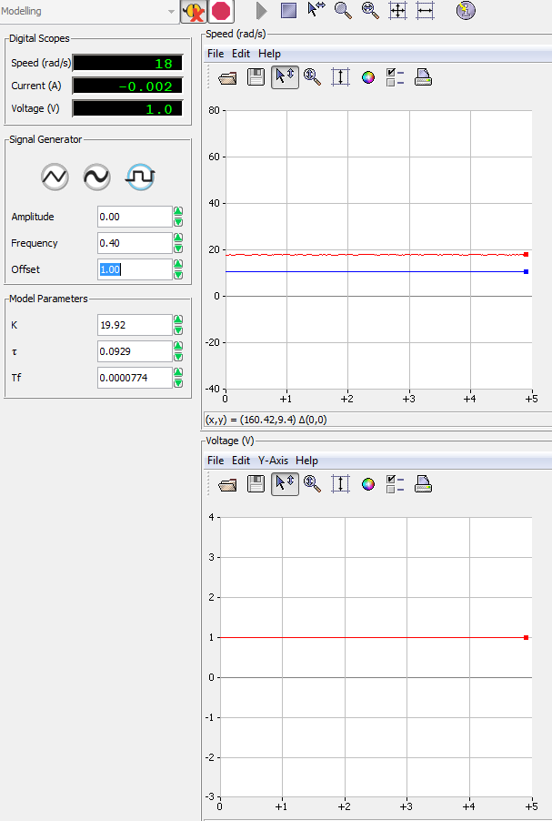                          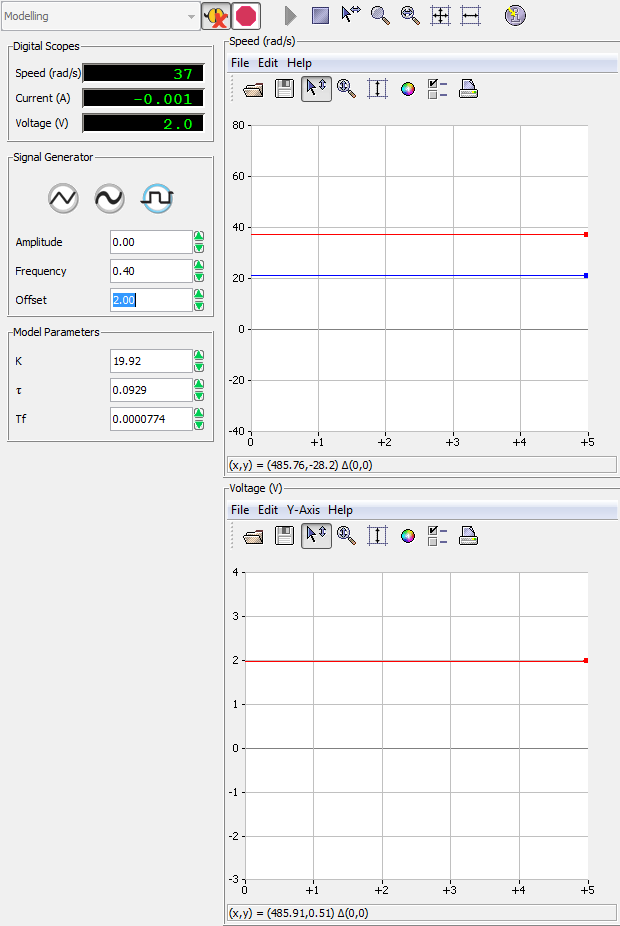

  Figure 1: Offset 1, Amplitude 0		                   Figure 2: Offset 2, Amplitude 0

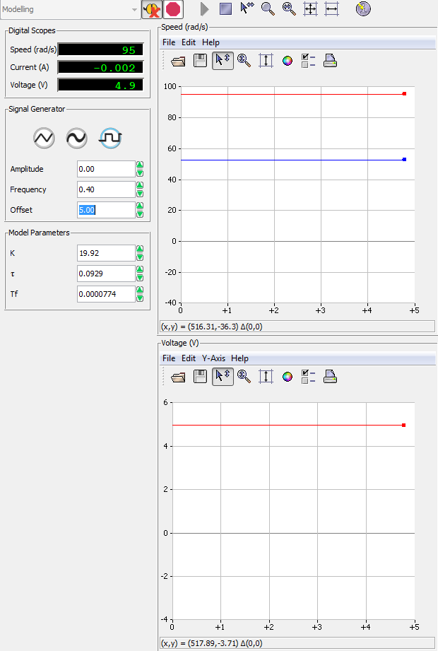

Figure 3: Offset 5, Amplitude 0

Figures 4,5,6 show the outputs with the offset equal to five volts and the amplitude of the square wave varied between one and five volts.

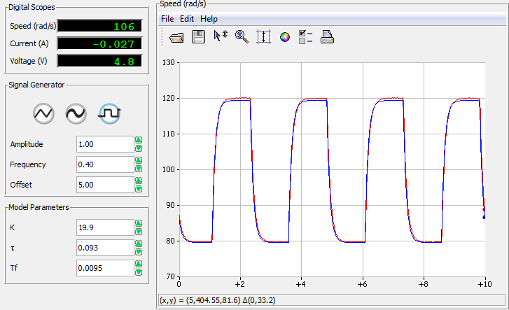

Figure 4: Offset 5V, Amplitude 1V

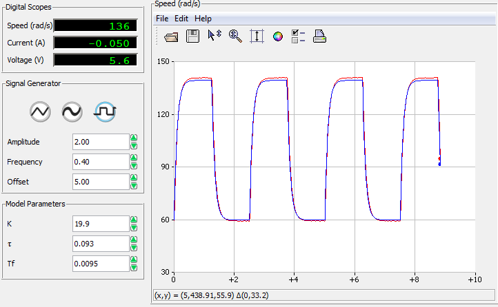

FIgure 5: Offset 5V, Amplitude 2V

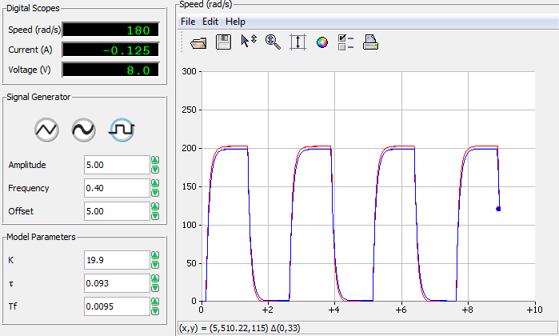

Figure 6: Offset 5V, Amplitude 5V

#### 5.2.1 Step 2 **_Maximum Velocity_**

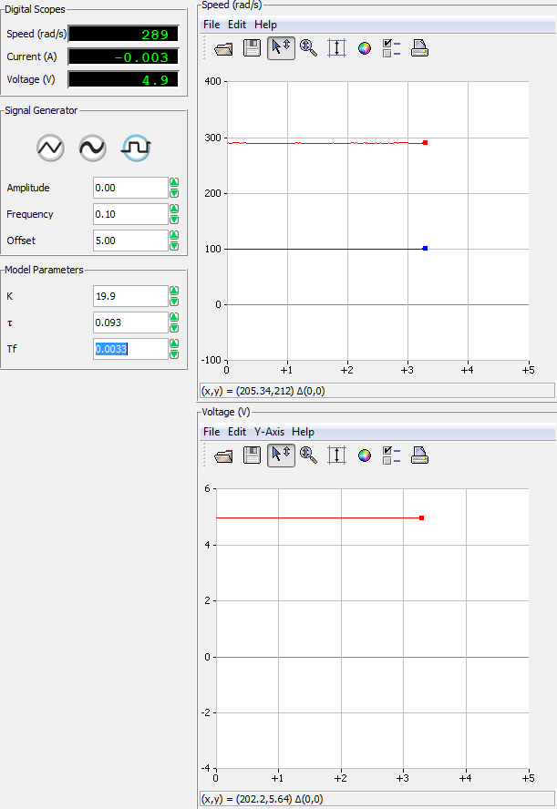

Figure 7: Finding maximum velocity

#### 5.2.2  Estimate the motor resistance

<table>
  <tr>
    <td>Sample #</td>
    <td>um</td>
    <td>Offset in measured current</td>
    <td></td>
    <td></td>
  </tr>
  <tr>
    <td>0</td>
    <td>0</td>
    <td>-0.007</td>
    <td></td>
    <td></td>
  </tr>
  <tr>
    <td>Sample #</td>
    <td>um</td>
    <td>Measured Current</td>
    <td>Corrected for Bias</td>
    <td>Resistance</td>
  </tr>
  <tr>
    <td>1</td>
    <td>-5</td>
    <td>-0.380</td>
    <td>-0.387</td>
    <td>12.9</td>
  </tr>
  <tr>
    <td>2</td>
    <td>-2</td>
    <td>-0.142</td>
    <td>-0.149</td>
    <td>13.4</td>
  </tr>
  <tr>
    <td>3</td>
    <td>1</td>
    <td>0.07</td>
    <td>0.063</td>
    <td>15.8</td>
  </tr>
  <tr>
    <td>4</td>
    <td>2</td>
    <td>0.133</td>
    <td>0.126</td>
    <td>15.8</td>
  </tr>
  <tr>
    <td>5</td>
    <td>5</td>
    <td>0.40</td>
    <td>0.393</td>
    <td>12.7</td>
  </tr>
  <tr>
    <td>Average Resistance Ravg</td>
    <td></td>
    <td></td>
    <td></td>
    <td>14.124</td>
  </tr>
</table>

Step 2 Comparing:

Average Rm =14.124 Ohms is somewhat different than the given value of 10.6 Ohms and this may be caused by non-linear influences in the motor.

#### 5.2.3 **_Estimate the motor torque constant_**

<table>
  <tr>
    <td>sample</td>
    <td>um</td>
    <td>Measured Speed</td>
    <td>Km</td>
  </tr>
  <tr>
    <td>1</td>
    <td>5</td>
    <td>100</td>
    <td>0.05</td>
  </tr>
  <tr>
    <td>2</td>
    <td>2</td>
    <td>38</td>
    <td>0.052</td>
  </tr>
  <tr>
    <td>3</td>
    <td>1</td>
    <td>18</td>
    <td>0.0556</td>
  </tr>
  <tr>
    <td>4</td>
    <td>-2</td>
    <td>38</td>
    <td>0.0526</td>
  </tr>
  <tr>
    <td>5</td>
    <td>-5</td>
    <td>99</td>
    <td>0.051</td>
  </tr>
  <tr>
    <td>Average back emf constant</td>
    <td></td>
    <td></td>
    <td>0.05214</td>
  </tr>
</table>

Step 2

Kmavg=0.05214

The given value for km is 0.0502 Nm /Amp, compared to an experimental value of 0.05214 Nm /Amp, this is a consistent result.

#### 5.2.4 Obtain the motor transfer function

K=19.1

𝜏=0.115

The values for the gain, K and time constant, 𝜏 are fairly close to the values obtained in the prelab of 19.9 and 0.093.

#### 5.3.1 **_The bump-test_**

Change in y = 148.68

Change in u = 5

K= 29.7

𝜏=0.1055

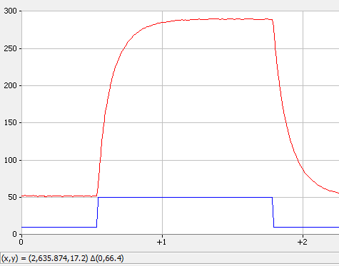

Figure 8: Bump Test

-0.63-0.526

#### 5.4 **Model validation**

Step 1

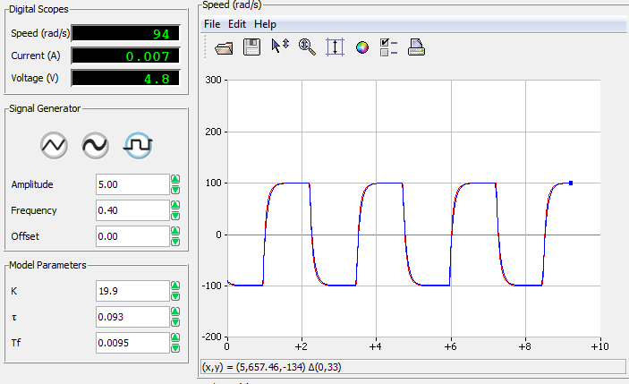

Figure 9: Model and Motor Response using prelab values

Step 2

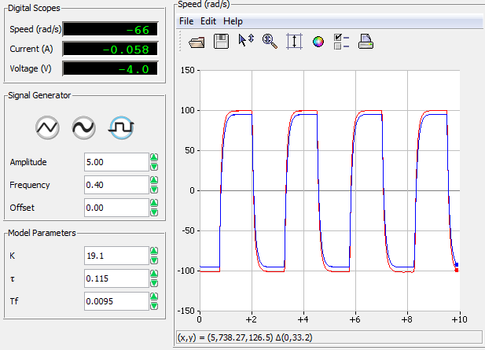

Figure 10: Model and Motor Response using values from 5.2.4

Step 3

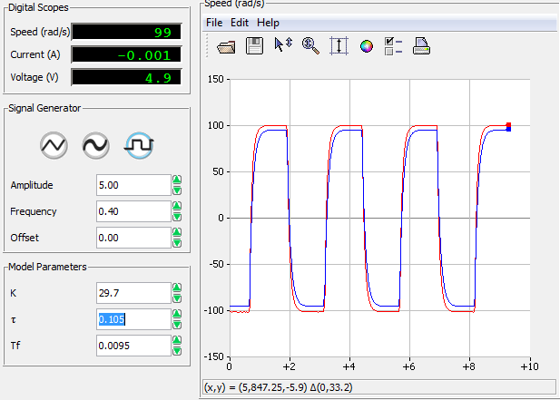

Figure 11: Model and Motor Response Using bump test values (5.3.1)

Step 4

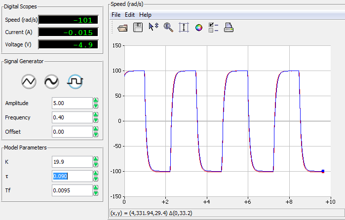

Figure 12: Model and Motor Response using adjusted values

### Discussion 

A dc motor can be accurately modelled mathematically derived from physical laws [1]. By taking the Laplace transform of static relations, the transfer function can be determined. This is expressed with parameters gain, K and time constant, 𝞽. Although calculating the correct model parameters are important, ensuring that Tf, the time constant of the filter, is around 0.01, is essential for an accurate model. 

Amplitude equaling 0 with offset varying results in a flat line, whereas setting the amplitude to 0 and varying the offset results in a square wave. Then, estimating the motor resistance involves firmly grasping the motor shaft to prevent movement while taking measurements. Once 5 samples are taken, the average resistance is computed using Ohm’s Law. The average resistance was 14.124 Ohms, which is somewhat consistent with the known value of 10.6 Ohms. Some reasons why the resistance cannot be computed using Ohm’s Law is because the system is significantly influenced by non-linear factors including:

* Saturation of the motor amplifier at 15 V.

* Coulomb friction in the motor. The motor starts turning when the input voltage is
above about 0.4 V required to counteract friction.

* Quantization error due to the finite resolution of the encoder.

* Since Lm is set to 0, there is a delay in the sampling frequency

 Inversely, the motor torque constant can be determined by letting the motor spin, taking voltage, angular velocity measurements and computing the average. The average back emf constant was 0.05124 [V.s /rad], which is very close to the given value of 0.0502 [V.s /rad].

Validating the model involves comparing the response of the model to the actual response, see fig [9]. The response are practically identical, indicating that our model is accurate under these conditions, however using the values computed in section 5.2.4, see fig [10] adds in a small amount of error between the model and actual responses. Using the bump-test values for 𝞽, and K, the error in the response becomes more distinct, but since the bump-test relies on visual estimation, this is unsurprising.

The model parameters, 𝞽 and K, that give the best response are the ones computed in the prelab, 0.093 and 19.9, respectively. 

### Conclusion

Overall, the system behaves linearly, so the mathematical model accurately tracks the actual behavior of the motor under lab conditions. Although models are useful to understand the behavior of a motor, the model fails to account for nonlinear factors resulting in imprecise calculations for the resistance. Tracking the model and motor response is valuable to verify mode correctness.

### References

[1] Dr. P. Agathoklis et al. 2016. Laboratory Manual for ELEC 360 Control Systems I. University of Victoria, Canada.

