**UNIVERSITY OF VICTORIA**

Department of Electrical and Computer Engineering

**ELEC 360 – Control Systems I**

**Laboratory 3**

**Experiment no.:**		2

**Title:**				Modeling and Identification of a DC Motor

**Date of Experiment:**		November 7, 2017

**Report Submitted on:**	November, 14, 2017

**To:**				Akash Panchal

**Laboratory Group No.:**	Group 35

**Names: **

1. David Li 	V00818631

2. Mike Viala	V00850502

## Table of Contents

\tableofcontents

## List of Figures

Figure: 1 Starting values for proportional control . . . . . . . . . . . . . . . . . . . . . . . . . . . . . . . . . . . . .3

Figure: 2 *k**p *= 0 *.*1V s/rad *, k**i *= 0 . . . . . . . . . . . . . . . . . . . . . . . . . . . . . . . . . . . . . . . . . .. . . . . . . 4

Figure: 3 *k**p *= 0*.*2V s/rad*, k**i *= 0 . . . . . . . . . . . . . . . . . . . . . . . . . . . . . . . . . . .  . . . . . . . . . . . . . . 4

Figure: 4 *k**p *= 0*.*3V s/rad *to, k**i *= 0 . . . . . . . . . . . . . . . . . . . . . . . . . . . . . . . . . . . . . . . . . . . . . . . .5

Figure: 5 *k**p *= 0*.*4V s/rad *, k**i *= 0 . . . . . . . . . . . . . . . . . . . . . . . . . . . . . . . . . . . . . . . . . . . . . . . . . 5

Figure: 6 *k**i *= 0.1 V /rad . . . . . . . . . . . . . . . . . . . . . . . . . . . . . . . . . . . . . . . . . . . . . . . . . . . . . . . . 6

Figure: 7 *k**i *= 0.4 V /rad . . . . . . . . . . . . . . . . . . . . . . . . . . . . . . . . . . . . . . . . . . . . . . . . . . . . . . . . 7

Figure: 8 *k**i *= 0.9 V /rad . . . . . . . . . . . . . . . . . . . . . . . . . . . . . . . . . . . . . . . . . . . . . . . . . . . . . . . . 7

Figure: 9 *k**i *= 1.4 V /rad . . . . . . . . . . . . . . . . . . . . . . . . . . . . . . . . . . . . . . . . . . . . . . . . . . . . . . . . 8

Figure: 10 *k**i *= 1.9 V /rad . . . . . . . . . . . . . . . . . . . . . . . . . . . . . . . . . . . . . . . . . . . . . . . . . . . . . . . 8

Figure: 11 *k**i *= 0.16 V /rad . . . . . . . . . . . . . . . . . . . . . . . . . . . . . . . . . . . . . . . . . . . . . . . . . . . . .  .9

Figure: 12 *k**p *= 0.1 V s /rad*, k**i *= 0.5 V /rad . . . . . . . . . . . . . . . . . . . . . . . . . . . . . . . . . .  . . . . . .10

Figure: 13 *k**p *= 0.1 V s /rad*, k**i *= 1.5 V /rad . . . . . . . . . . . . . . . . . . . . . . . . . . . . . . . . . . . . . . . . 11

Figure: 14 *k**p *= 0.1 V s /rad*, k**i *= 2.5 V /rad . . . . . . . . . . . . . . . . . . . . . . . . . . . . . . . . . . . . . . . . 11

Figure: 15 *k**p *= 0.1 V s /rad*, k**i *= 3.5 V /rad . . . . . . . . . . . . . . . . . . . . . . . . . . . . . . . . . . . . . . . . 12

Figure: 16 *k**p *= 0.1 V s /rad*, k**i *= 5 V /rad . . . . . . . . . . . . . . . . . . . . . . . . . . . . . . . . . . . . . .. . . . 12

Figure: 17 *k**p *= 0.05 V s /rad*, k**i *= 0.5 V /rad . . . . . . . . . . . . . . . . . . . . . . . . . . . . . . . . . . . .. . . .13

Figure: 18 *k**p *= 0.15 V s /rad*, k**i *= 0.5 V /rad . . . . . . . . . . . . . . . . . . . . . . . . . . . . . . . . . . . .. . . .13

Figure: 19 *k**p *= 0.25 V s /rad*, k**i *= 0.5 V /rad . . . . . . . . . . . . . . . . . . . . . . . . . . . . . . . . . . . .. . . .14

Figure: 20 *k**p *= 0.30 V s /rad*, k**i *= 0.5 V /rad . . . . . . . . . . . . . . . . . . . . . . . . . . . . . . . . . . . .. . . .14

Figure: 21 *k**p *= 0.1 V s /rad*, k**i *= 0.5 V /rad . . . . . . . . . . . . . . . . . . . . . . . . . . . . . . . . . . . . .. . .  15

Figure: 22 Setting the Amplitude to 0 rad /s . . . . . . . . . . . . . . . . . . . . . . . . . . . . . . . . . . . . . . . .16

Figure: 23 Applying load with finger when *k**p *= 0.2 V s /rad*, k**i *= 0 V /rad . . . . . . . . . . . . . . . .  17

Figure: 24 Applying load with finger when *k**p *= 0.5 V s /rad*, k**i *= 0 V /rad . . . . . . . . . . . . . . . . .17

Figure: 25 Applying load with finger when *k**p *= 0 V s /rad*, k**i *= 1 V /rad . . . . . . . . . . . . . . . . . . 18

Figure: 26 Applying load with finger when *k**p *= 0.2 V s /rad*, k**i *= 1 V /rad . . . . . . . . . . . . . . . . .19

Figure: 27 Finding the value for critical gain, *k**pc*, manually. . . . . . . . . . . . . . . . . . . . . . . . . .. . .19

Figure: 28 Estimating the corresponding period, *T**pc *. . . . . . . . . . . . . . . . . . . . . . . . . . . . . . . . .20

Figure: 29 Using the set values of *k**p *= 0*.*2*V s/rad *and *k**i *= 0*.*278*V/rad *. . . . . . . . . . . . . . . . . . 21

Figure: 30 Manually adjusted values until slightly underdamped response is reached. . . . . . . .22

## Summary

Designing Proportional Integral (PI) controller requires understanding of qualitative properties of proportional and integral controllers, determining values of external parameters such as (kp and ki) given PI specifications, and measuring the response of the system to load disturbances [1].

## Introduction

This laboratory demonstrates experimentally the effects of altering various parameters of a proportional and proportional integral controlled direct current motor.

## Experimental Results (note: observations are included in "Discussion")

### 5.1.1 Proportional Control 

**_Step 1: _**kp = 0.4 V s/rad, ki = 0

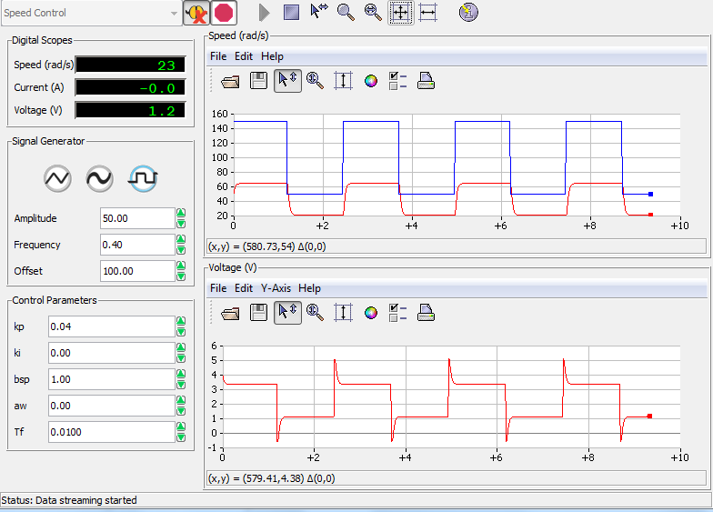

Figure: 1  – Starting values for proportional control

**_Step 2:_** kp from 0.1 V s/rad to 0.4 V s/rad, ki = 0

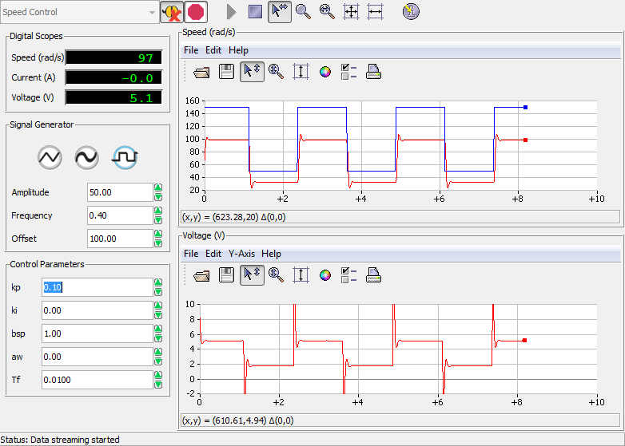

Figure: 2  – *kp *= 0 *.*1V s/rad *, ki *= 0

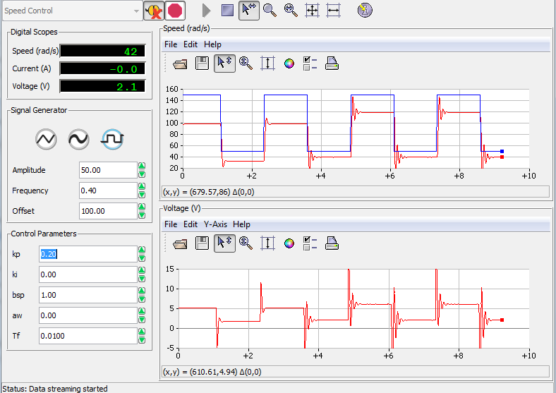

Figure: 3  – *kp *= 0*.*2V s/rad*, ki *= 0

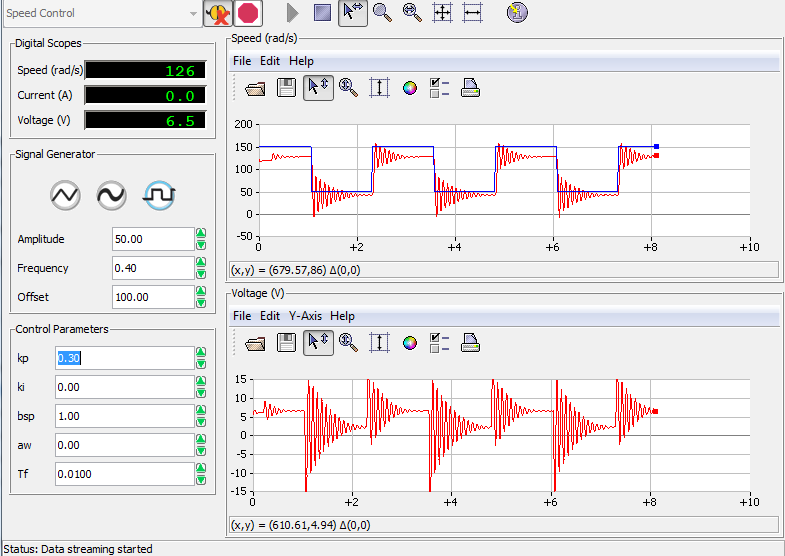

Figure: 4  – *kp *= 0*.*3V s/rad *to, ki *= 0

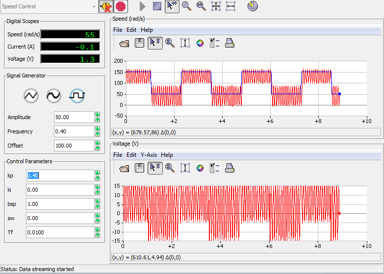
Figure: 5  –  *kp *= 0*.*4V s/rad *, ki *= 0

### 5.1.2. Integral Control

**_Step 1:_** Kp = 0, Ki = 0.4 V/rad 

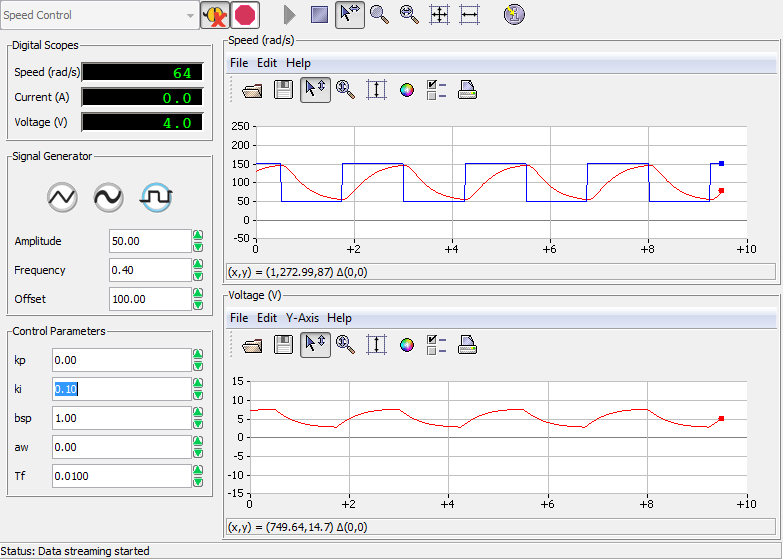

Figure: 6  – *ki *= 0.1 V /rad

**_Step 2:_** Ki from 0 V/rad to 1.9 V/rad

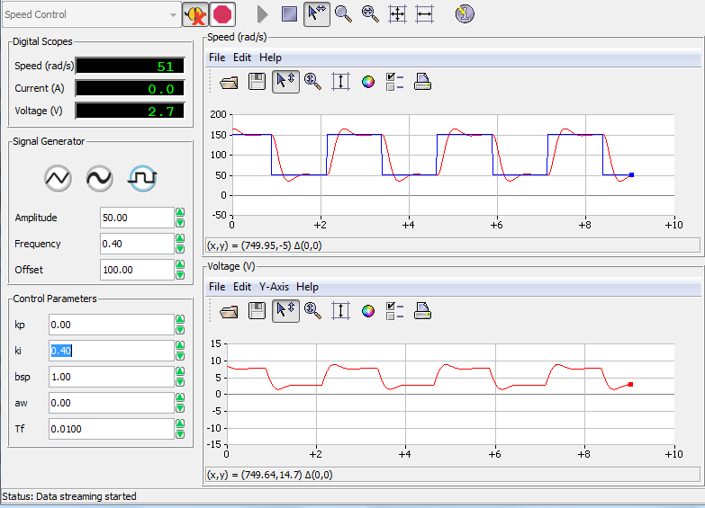

Figure: 7  – *ki *= 0.4 V /rad

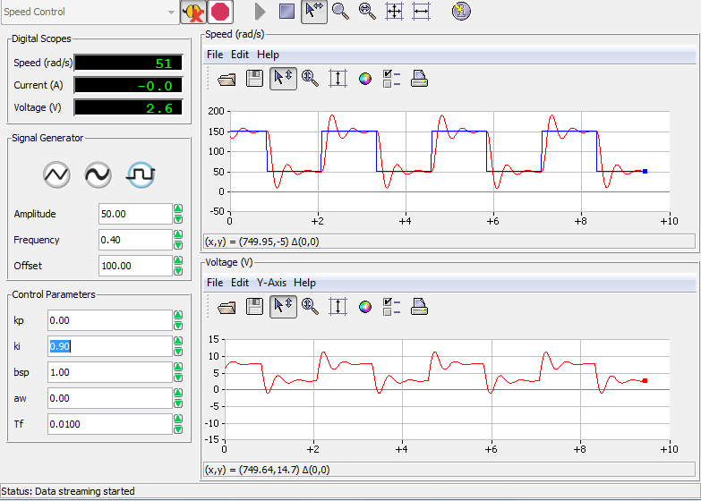

Figure: 8 – *ki *= 0.9 V /rad

Figure: 9 – *ki *= 1.4 V /rad

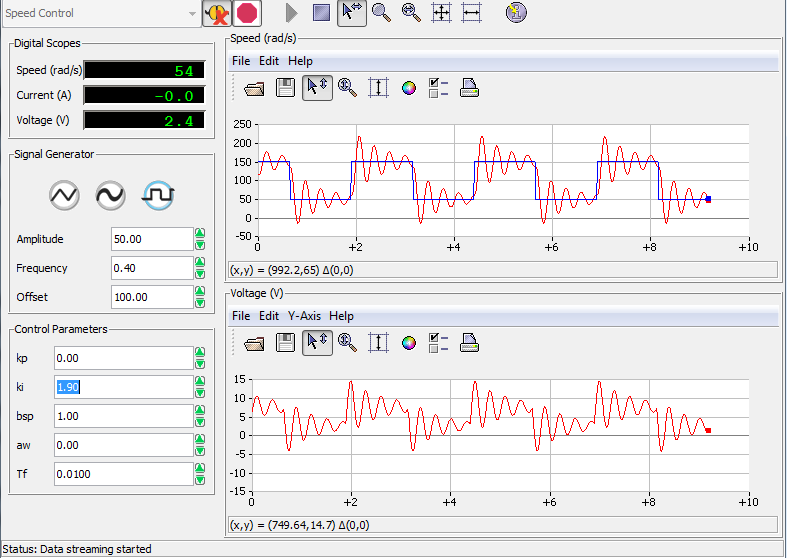

Figure: 10 – *ki *= 1.9 V /rad

**_Step 3:_** The value of integral gain which gives the quickest response without overshooting is shown in Figure 11 Below. The settling time for this closed loop system can be seen to be 0.75sec.

Figure: 11 – *ki *= 0.16 V /rad

**_Step 4:_** Please see "Discussion"

### 5.1.3. Proportional and Integral Control

**_Step 1:_** Kp = 0, Ki = 0.5

Figure: 12 – *kp *= 0.1 V s /rad*, ki *= 0.5 V /rad

**_Step 2:_** *b**sp *= 1, *k**p *= 0.1 V s/rad, *k**i *from 0.5 to 5 V/rad.

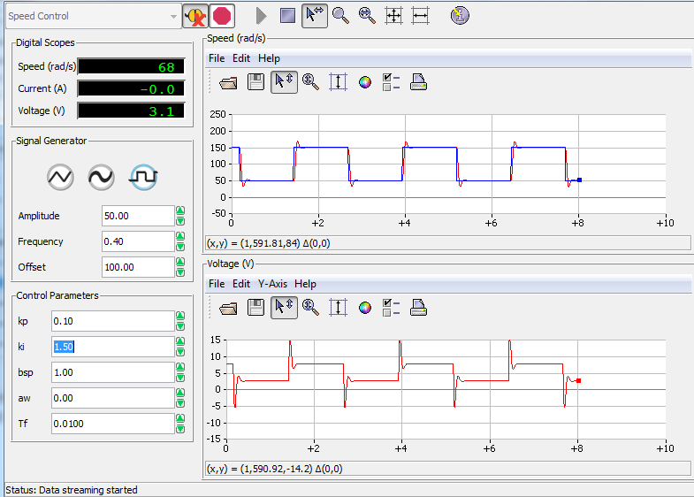

Figure: 13 – * kp *= 0.1 V s /rad*, ki *= 1.5 V /rad

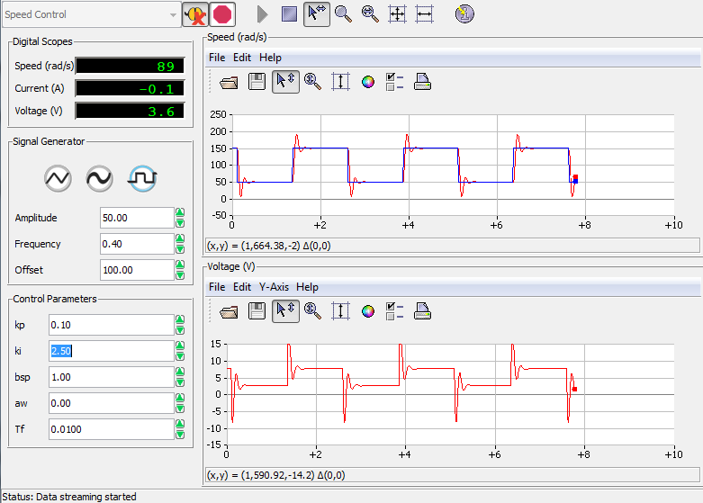

Figure: 14 – *kp *= 0.1 V s /rad*, ki *= 2.5 V /rad 

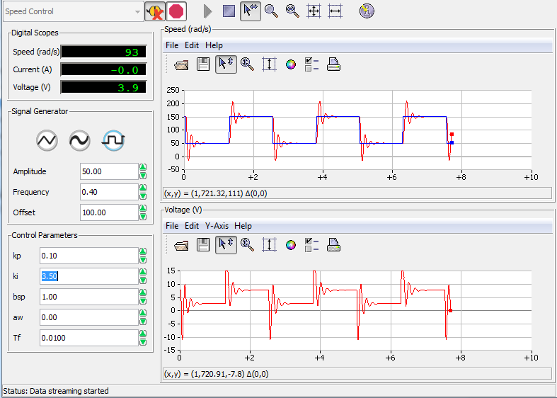

Figure: 15 – *kp *= 0.1 V s /rad*, ki *= 3.5 V /rad

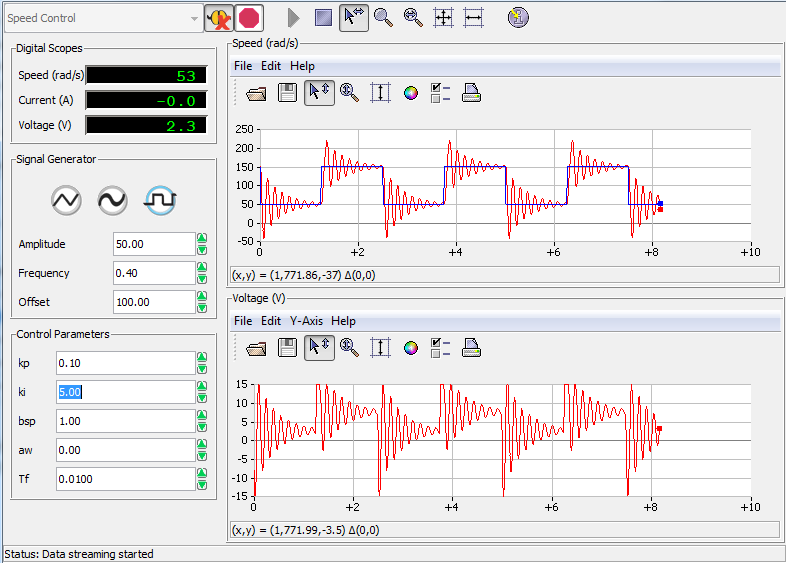

Figure: 16 – *kp *= 0.1 V s /rad*, ki *= 5 V /rad

**_Step 3:_** *k**i *= 0.5 V/rad, *b**sp *= 1, *k**p *from 0.05 to 0.3 V s/rad. 

Figure: 17 –  *kp *= 0.05 V s /rad*, ki *= 0.5 V /rad 

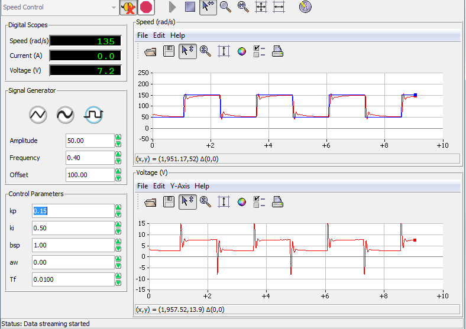

Figure: 18 – *kp *= 0.15 V s /rad*, ki *= 0.5 V /rad

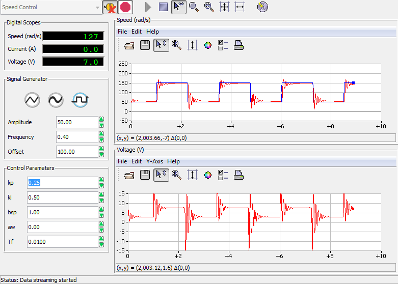

Figure: 19 – *kp *= 0.25 V s /rad*, ki *= 0.5 V /rad 

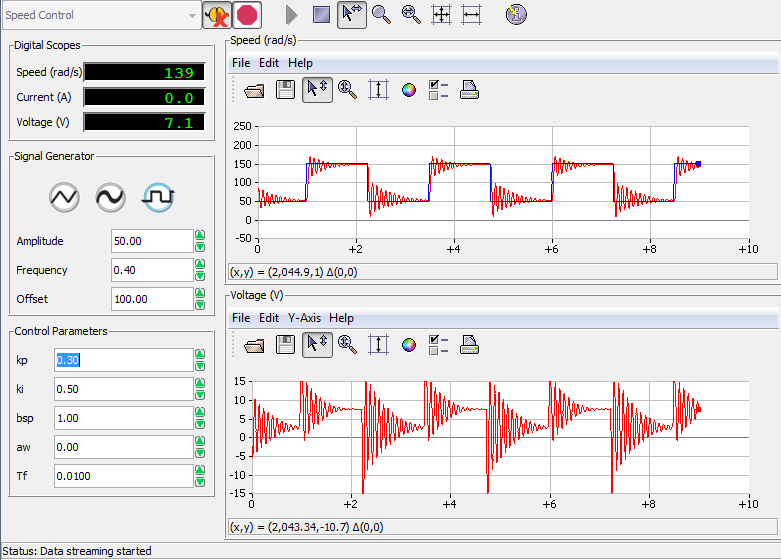

Figure: 20 – *kp *= 0.30 V s /rad*, ki *= 0.5 V /rad

**_Step 4:_** Set *b**sp*, the proportional and integral gains to the values obtained in section 4.3.3.


Figure: 21 – *kp *= 0.1 V s /rad*, ki *= 0.5 V /rad

**_Step 5:_** Please see "Discussion".

### 5.2. Closed-loop System’s Response to Disturbances

**_Step 1:_** The response to disturbance *T**d *is a constant reference speed of 150 rad/s. The signal generator module parameters are 0 [rad/s] Amplitude and 150 [rad/s] Offset.


Figure: 22 – Applying load with finger when *kp *= 0.2 V s /rad*, ki *= 0 V /rad

**_Step 2:_** A pure proportional controller (*k**i *= 0, *b**sp *= 1) with gain *k**p *= 0.20 Vs/rad. A torque is applied manually by gently touching the inertial load with a finger.

Figure: 23 – Applying load with finger when *kp *= 0.2 V s /rad*, ki *= 0 V /rad

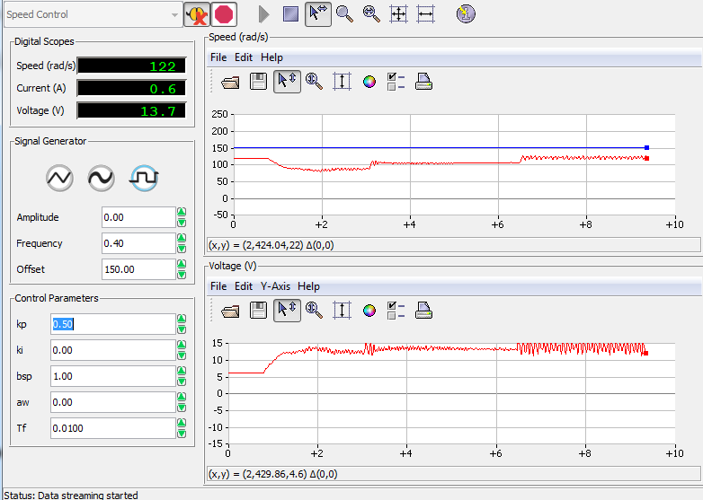

Figure: 24 – Applying load with finger when *kp *= 0.5 V s /rad*, ki *= 0 V /rad

**_Step 3:_** A controller with pure integral action (*k**p *= 0), such that ki = 1.0 V/rad. A disturbance torque is applied manually.

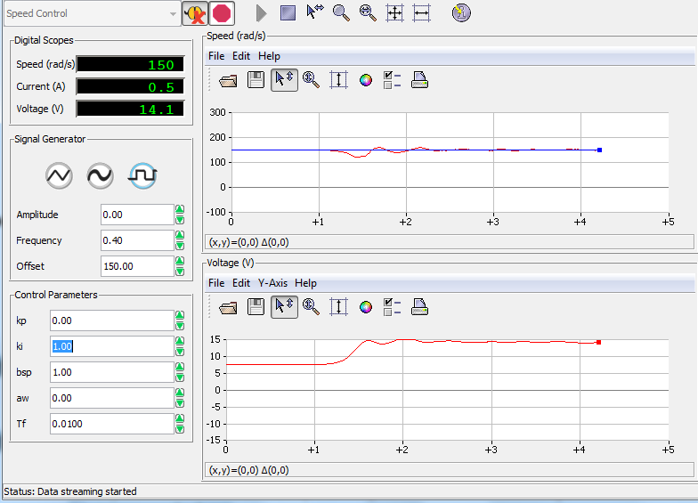

 Figure: 25 – Applying load with finger when kp = 0 V s /rad, ki = 1 V /rad

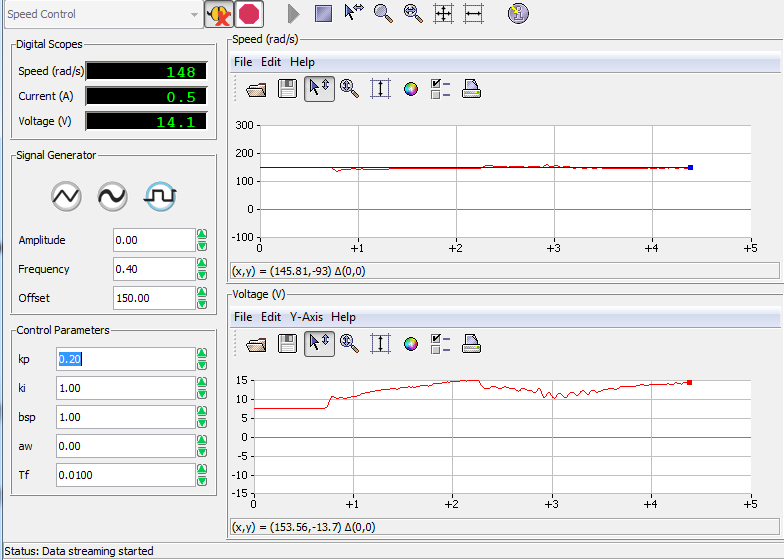

Figure: 26 – Applying load with finger when kp = 0.2 V s /rad, ki = 1 V /rad

### 5.3. Manual Tuning of PI Controller: Ziegler-Nichols

**_Step 1:_** The critical gain, *k**pc*, (*k**i *= 0, *b**sp *= 1), is determined where the system becomes critically stable and a stable oscillation is achieved. The critical period *T**pc *of the corresponding oscillations is also determined. 

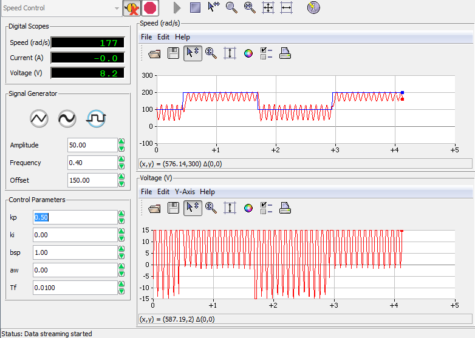

Figure: 27 – Finding the value for critical gain, kpc, manually.

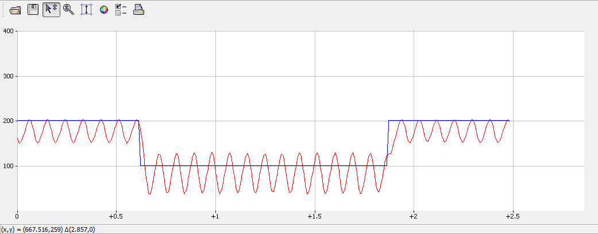

Figure: 28 – Estimating the corresponding period, Tpc

The values in Table 1 were calculated using the following equations: 

*k**p *= 0.4 *k**pc *

*T**i *= 0.8 *T**pc *

*k**i *= *k**p */ *T**i *or *k**i *= 0.5 * *k**pc */ *T**pc*

<table>
  <tr>
    <td>Table 1 - Ziegler - Nichols Design</td>
    <td></td>
    <td></td>
    <td></td>
    <td></td>
    <td></td>
  </tr>
  <tr>
    <td>Description</td>
    <td>Symbol</td>
    <td></td>
    <td>In-Lab Result</td>
    <td></td>
    <td>Units</td>
  </tr>
  <tr>
    <td>Properties of PI Control</td>
    <td></td>
    <td></td>
    <td></td>
    <td></td>
    <td></td>
  </tr>
  <tr>
    <td>Critical proportional gain</td>
    <td></td>
    <td>kpc</td>
    <td>0.5</td>
    <td>Vs/rad</td>
    <td></td>
  </tr>
  <tr>
    <td>Critical period for kpc</td>
    <td></td>
    <td>Tpc</td>
    <td>0.9</td>
    <td>s</td>
    <td></td>
  </tr>
  <tr>
    <td>Ziegler-Nichols design</td>
    <td></td>
    <td></td>
    <td></td>
    <td></td>
    <td></td>
  </tr>
  <tr>
    <td>Proportional gain</td>
    <td></td>
    <td>kp</td>
    <td>0.2</td>
    <td>Vs/rad</td>
    <td></td>
  </tr>
  <tr>
    <td>Integral gain</td>
    <td></td>
    <td>ki</td>
    <td>0.278</td>
    <td>V/rad</td>
    <td></td>
  </tr>
</table>

**_Step 2:_** The parameters of the signal generator module window were set as listed in Table 2.7. Table 2.7 is copied from the lab manual for reference.

<table>
  <tr>
    <td></td>
    <td></td>
    <td></td>
    <td></td>
  </tr>
  <tr>
    <td>Table 2.7 - Module parameters for the Ziegler-Nichols-tuned PI controller</td>
    <td></td>
    <td></td>
    <td></td>
  </tr>
  <tr>
    <td>Signal Type</td>
    <td>Amplitude [rad/s]</td>
    <td>Frequency [Hz]</td>
    <td>Offset [rad/s]</td>
  </tr>
  <tr>
    <td>Square Wave</td>
    <td>50</td>
    <td>0.5</td>
    <td>150</td>
  </tr>
</table>

bsp  was set to 1, both proportional and integral gains to their Ziegler-Nichols values as calculated. Figure 29 below shows the response.

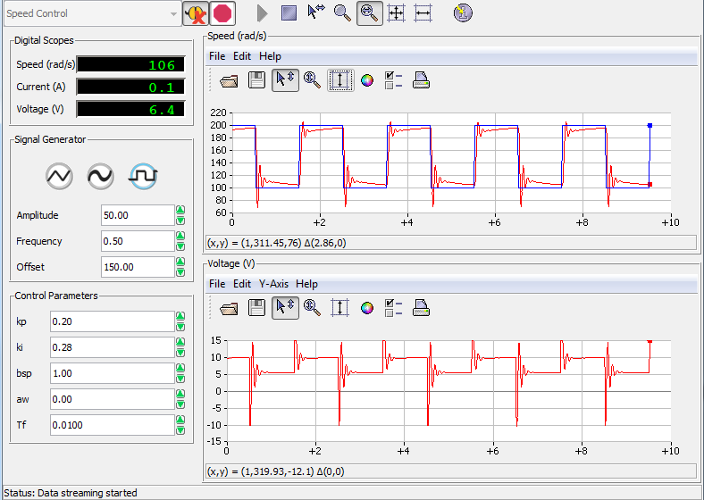

Figure: 29 – Using the set values of kp = 0.2V s/rad and ki = 0.278V /rad

**_Step 3:_** The proportional and integral gain was adjusted manually to give a very slightly under-damped response with no saturation of the control signal.

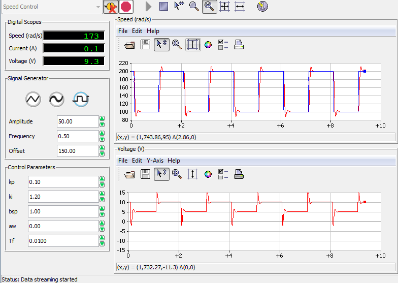

Figure: 30 – Manually adjusted values until slightly underdamped response is reached.

The new gain values are: Kp = 0.10 Vs /rad and Ki= 1.20 V /rad.

**_Step 4:_** Please see "Discussion".

**_Step 5:_** Please see "Discussion".

## Discussion

### Proportional Control (5.1.1)

By examining Figures 1-5, it can be seen that using a proportional controller by itself results in an inaccurate model. The model best out of all the samples is when kp = 0.4 V s / rad, (see Figure 4), however as kp increases, the frequency and overshoot of oscillations increase as well. Furthermore, the settling time of the system increases as kp increases, but the rise time is decreases as kp decreases. The plots are consistent with the analysis performed in the prelab, increasing kp increases error, and the steady state error is a constant.

### Integral Control (5.1.2)

Figures 6-11 illustrate the behaviour of the model as the value of the integral constant, ki, varies from a minimum of 0.1 V /rad to a maximum of 1.9 V /rad. As the value of ki increases, the rise time decreases, but peak overshoot increases. When ki = 0.16 V / rad, the system gives the quickest response with no visible overshoot (see Figure 11). The analysis in section 4.2 is consistent with the experimental results because the steady-state error is 0 (see Figures 6-8 and 11).

### Proportional and Integral Control (5.1.3)

The tracking error when kp is constant at 0.1 V s / rad and ki varies from (0.5 to 5.0 V /rad) (See Figures 12-16) increases past 1.5 V /rad. This suggests the ideal value for kp lies between 0.5 to 1.5 V /rad and aligns with predicted values in 4.3.3.


As ki is constant at 0.5 V/rad and kp varies from 0.05 V s /rad to 0.30 V s / rad, the tracking error  increases significantly when kp is greater than 0.15 Vs /rad because of larger and more frequent oscillations (See Figures 17-21). Furthermore, the tracking error is reasonable when kp is between 0.05 and 0.15 Vs /rad, which implies the ideal value for kp lies within this range.

  

Using the values obtained from 4.3.3, the tracking error is small and the control signal approaches the actual signal (See Figure 21). The analysis in 4.3 suggested that a PI controller would have no steady state error because the calculated steady-state velocity for a unit step input was 1. 

### Closed-loop System’s Response to Disturbances (5.2)

Figures (22-26) suggest that purely proportional and purely integral controllers behave irregularly to responses, however, purely integral controllers respond better to disturbances, whereas purely proportional controllers experience greater fluctuation.

Tracking error when a disturbance is applied to a proportional and integral controller is relatively small compared to tracking errors for purely proportional and purely integral controllers (see Figure 26).

### Manual Tuning of PI Controller: Ziegler-Nichols (5.3)

Finding the value of kpc involved finding a value for gain that resulted in stable oscillation. Also, the critical period for critical gain can be computed by counting periods and dividing by time elapsed. See Figures 27 and 28. 

<table>
  <tr>
    <td>Description</td>
    <td>Symbol</td>
    <td></td>
    <td>In-LabResult</td>
    <td></td>
    <td>Units</td>
  </tr>
  <tr>
    <td>Properties of PI Control</td>
    <td></td>
    <td></td>
    <td></td>
    <td></td>
    <td></td>
  </tr>
  <tr>
    <td>Critical proportional gain</td>
    <td></td>
    <td>kpc</td>
    <td>0.5</td>
    <td>Vs/rad</td>
    <td></td>
  </tr>
  <tr>
    <td>Critical period for kpc</td>
    <td></td>
    <td>Tpc</td>
    <td>0.9</td>
    <td>s</td>
    <td></td>
  </tr>
  <tr>
    <td>Ziegler-Nichols design</td>
    <td></td>
    <td></td>
    <td></td>
    <td></td>
    <td></td>
  </tr>
  <tr>
    <td>Proportional gain</td>
    <td></td>
    <td>kp</td>
    <td>0.2</td>
    <td>Vs/rad</td>
    <td></td>
  </tr>
  <tr>
    <td>Integral gain</td>
    <td></td>
    <td>ki</td>
    <td>0.278</td>
    <td>V/rad</td>
    <td></td>
  </tr>
</table>

Manually adjusting the values of kp, and ki resulted in the tracking error becoming negligible once steady state was achieved, peak overshoot was relatively small, settling time and rise time were desirable .

## Conclusion

Individually, purely proportional and purely integral controllers have desirable quantities, but behave different circumstances. Using a proportional and integral controller compensate for the shortcomings of purely proportional and purely integral controllers while increasing reliability. The mathematical models predicted accurately the response of the system for each control method.

## References

[1] Dr. P. Agathoklis et al. 2016. Laboratory Manual for ELEC 360 Control Systems I. University of Victoria, Canada.

