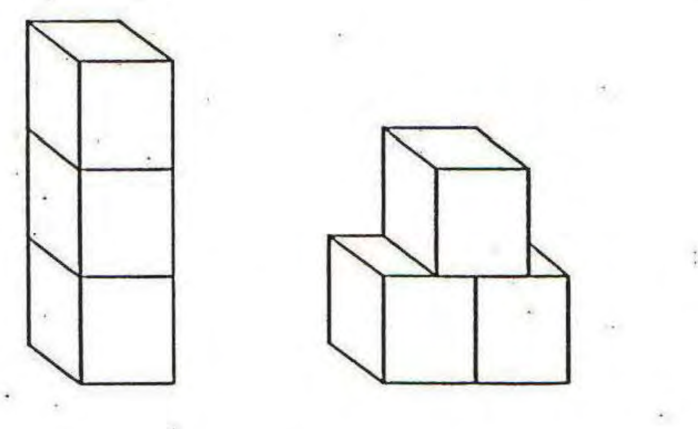

**UNIVERSITY OF VICTORIA**

Department of Electrical and Computer Engineering

**ELEC 360 – Control Systems I**

**Laboratory**

Experiment no.:		4

Title:			Introduction to the Programming of a Robot Arm

Date of Experiment:	October, 3, 2017

Report Submitted on:	October, 10, 2017

To:			Akashdi Panchal

Laboratory Group No.:	Group 35

Names: 

1. David Li 	V00818631

2. Mike Viala	V00850502

### **Summary**

The lab focussed on controlling a Lab-Volt Servo Robot robot arm by inputting commands using a remote, and then using GUI to build a pyramid given 3 blocks [1].  Some creativity was necessary as the second block cannot be placed directly beside the first one as the grapple with collide with the ground or the first block. This problem was solved by lightly bumping the second block with the grapple.

FIgure 1: The two arrangements for the blocks [1].

Although, the angular mode was easier to control using the remote, linear mode was easier to program using the GUI. 

### **Introduction** (Describe the objective of the lab)

    

The purpose of the lab was to to become familiar with programming a robot arm to perform simple tasks. Using the remote and saving points in absolute mode, the robot arm is taught to pick up and drop off a block, however, minor variations in the starting position of the block may result in significantly different destination points. Using the "hard home" [1] command, allows the robot arm to return to the starting position. This is useful when testing run the robot arm and verification.

Answers to the Pre-laboratory Assignments

### **Experimental Results **

Using the point editor, instructions for picking up the blocks were done step-by-step.

1. Move to Block

2. Open Grapple to pick up Block

3. Firmly Close the Grapple

4. Move slightly above the Block to avoid collisions with the other blocks

5. Move to the destination

6. Release the grapple

This process, can be repeated with slight varieties for the rest of the blocks. Stacking the blocks in a pyramid shape requires a little creativity because the two base blocks cannot be dropped side-by-side with the grapple. Programming the robot arm to slightly nudge the second block into the correct positions solves this problem.

### **Discussion**

Although the robot arm infinity repeat a routine once it is taught, however, it performs horrendous during unexpected circumstances. Loading the robotics program, then saving points through the Point Editor grants more control over speed and position. Furthermore, pressing the move button when home is selected is multiple times faster than the hard home option. Interestingly, less commands were needed in angular mode compared to linear mode. This implies that using angular mode to pick-up blocks is easier than linear mode. Overall, human supervision is needed for the operation of the robot arm and an emergency stop button is essential to ensure the robot arm and the surrounding environment is not harmed.

### **Conclusions**

Programming a robot arm is easiest with a graphical user interface and not a remote. Despite a reduction in the number of commands using angular mode used, the GUI allows the user more control over the robot including speed, positioning and going back to previously visited points.

### **References**

[1] Dr. P. Agathoklis et al. 2016. Laboratory Manual for ELEC 360 Control Systems I. University of Victoria, Canada.

