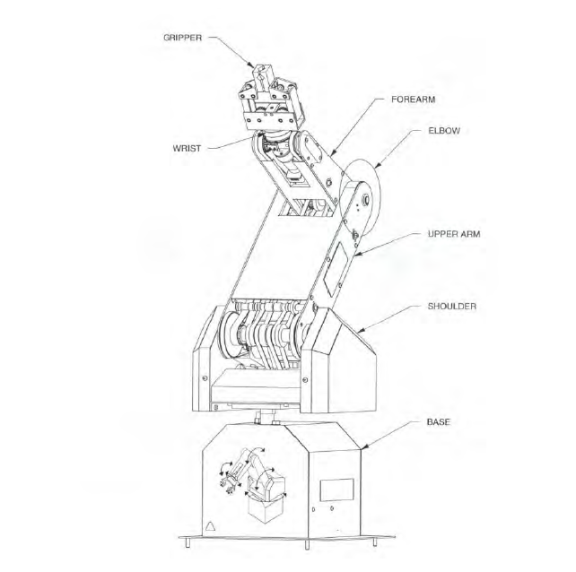

**UNIVERSITY OF VICTORIA**

Department of Electrical and Computer Engineering

**ELEC 360 – Control Systems I**

**Laboratory 1**

**Experiment no.:**		4

**Title:**				Introduction to the Programming of a Robot Arm

**Date of Experiment:**		October, 3, 2017

**Report Submitted on:**	October, 10, 2017

**To:**				Akashdi Panchal

**Laboratory Group No.:**	Group 35

**Names: **

1. David Li 	V00818631

2. Mike Viala	V00850502

### **Table of Contents**

[[TOC]]

### **List of Figures**

**Figure 1: Diagram of the Lab-Volt Servo Robot		                      			         4	**

**Figure 2 - GUI for the PC application for programming the robot arm                                   5**

**Figure 3: ****Position 1 (left) and position 2 (right) of the blocks                                                 6**

### **Summary**

In experiment four, a Lab-Volt Servo Robot robot arm was controlled by inputting commands using a hand-held remote, and then using a GUI that instruct the robot to build a pyramid given three blocks. A diagram of the Lab-Volt Servo Robot robot arm can be seen in Figure 1 below.

Figure 1: Diagram of the Lab-Volt Servo Robot

The GUI for programming the robot arm is shown in Figure 2 below. The points on the left of the figure show the sequence of motion events the robot is expected to perform. The arrows on the screen can be clicked which will move the robot arm in the direction indicated by the arrow. Once the desired orientation is achieved "Save Position Point" can be clicked to save the point. The speed set point on the top right of the figure can be modified to achieve the desired speed of the robot. Finally, to get the robot to run through all the points sequentially, the execute but is pushed.

Figure 2 - GUI for the PC application for programming the robot arm

### **Introduction** 

The objective of this lab is to use three methods of programming a Lab-Volt Servo Robot robot arm to move three wooden blocks from position 1 to position 2 as shown in Figure 3 below.

    

                   Figure 3: Position 1 (left) and position 2 (right) of the blocks                       

### **Experimental Results **

Angular instruction set:

1. Move to position 1 cm above block while opening grapple

2. Move down to a position where the grapple can grab the block

3. Firmly close the grapple

4. Move slightly above the block to avoid collisions with the other blocks

5. Move to the destination

6. Release the grapple

7. Repeat 1 through 4

8. Move to position 2 cm to the left of first block placed

9. Release the grapple

10. Move above block by 1cm

11. Move to left of block by 1 cm

12. Push block to the right until it touches the first block placed

13. Repeat steps 1 to 6

Linear Instruction Set:

1. Move away from the home position towards block and rotate wrist up

2. Move to position 1 cm above block while opening grapple

3. Move down to a position where the grapple can grab the block

4. Firmly close the grapple

5. Move slightly above the block to avoid collisions with the other blocks

6. Move to the destination

7. Release the grapple

8. Repeat 1 through 4

9. Move to position 2 cm to the left of first block placed

10. Release the grapple

11. Move above block by 1cm

12. Move to left of block by 1 cm

13. Push block to the right until it touches the first block placed

14. Repeat steps 1 to 6

Stacking the blocks in a pyramid shape requires a little creativity because the two base blocks cannot be dropped side-by-side with the grapple. Programming the robot arm to slightly nudge the second block into the correct positions solved this problem.

### **Discussion**

Using the PC based robotics program and saving points through the Point Editor grants more control over speed and position than using the handheld terminal method of programming the points. The option of pressing the move button when home is selected is significantly faster than the hard home option required to move to the home position using the handheld terminal. Since all points were required to be deleted when a new program was written, a hard-home procedure was required to be performed for every reprogramming when using the terminal. Furthermore, alterations, such as adding a position between saved positions was not possible. Using the PC application, however, adding and removing points was easily done and greatly facilitated debugging a procedure.

In linear mode, the robot arm behaved linearly in all three x,y, and z directions, i.e. the wrist moved in a straight line towards the target position. However, the position of the gripper was not compensated for in these movements, and adjustments were required using angular commands to ensure the gripper remained in the correct orientation. This correction was required in both angular and linear mode, so it is not a disadvantage of linear mode. A complication that did occur in linear mode, that was not an issue in angular mode, was the increased probability of moving into a position at the limits of the robot’s movement boundaries. More steps were required in linear mode than angular to ensure the robot did not extend into forbidden orientations. For example, in the experiment, the robot was instructed to move directly from home position to above the initial position of the blocks. Even though this was a direct path and within the robot’s reach, a fault occurred as the "wrist" of the arm attempted to swivel beyond its bounds. The wrist could not swivel fast enough to avoid the fault without adding intermediate saved points. In angular mode, only the joint that is instructed to move actually does move, making the resultant motion of the robot less likely to fault. So although linear mode required fewer adjustments to move to a position, angular mode had the benefit of being less likely to fault on the path. Because of this, angular mode required fewer programmed points in between the original position and the destination. The advantage that angular programming had over linear was particular to this lab’s specific set-up. Repositioning the initial position of the blocks could eliminate the advantage that angular has over linear, and could make linear slightly easier to program. 

### **Conclusions**

Programming a robot arm is easiest with a graphical user interface and not the handheld terminal. The GUI allows the user more control over the robot including speed, positioning and going back to previously visited points as well more versatility in editing or adding new point.

The angular method used the minimal number of saved points to perform the required task. Since the linear method could not make a direct path from the home position to a position above the blocks, it required one extra step than the angular method.

Although the robot arm can continue to repeat a routine once it is taught, it performs horrendously during unexpected circumstances.Overall, human supervision is needed for the operation of the robot arm in case of an unexpected situation, and an emergency stop button is essential to ensure the robot arm and the surrounding environment is not harmed.

### **References**

[1] Dr. P. Agathoklis et al. 2016. Laboratory Manual for ELEC 360 Control Systems I. University of Victoria, Canada.

