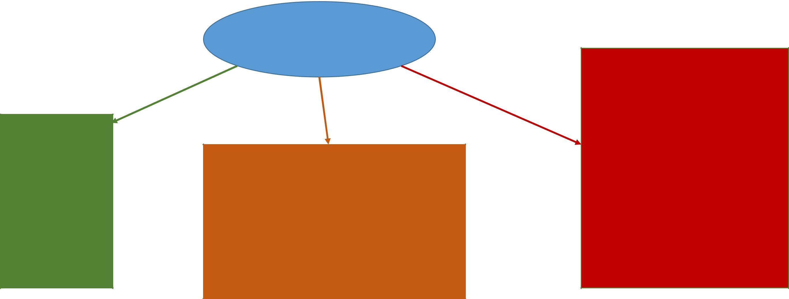
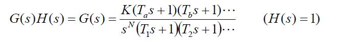
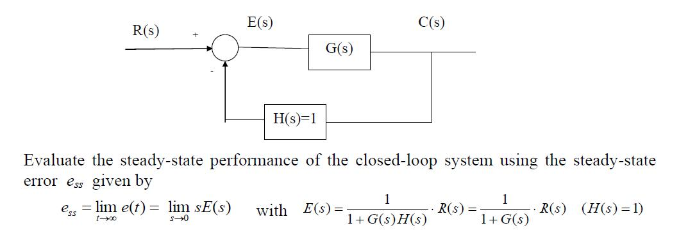
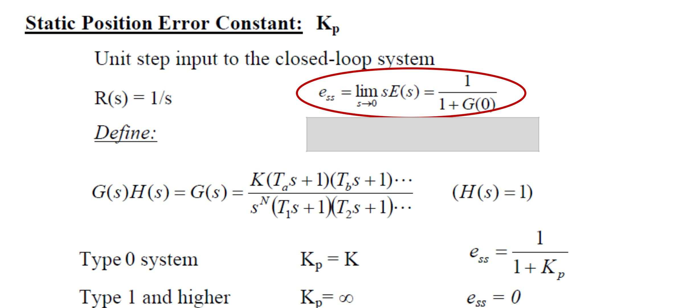
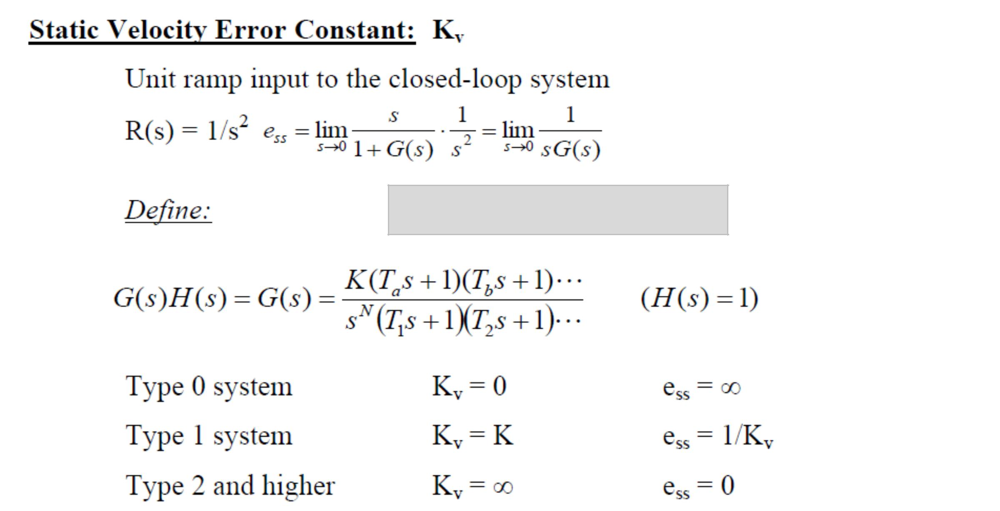
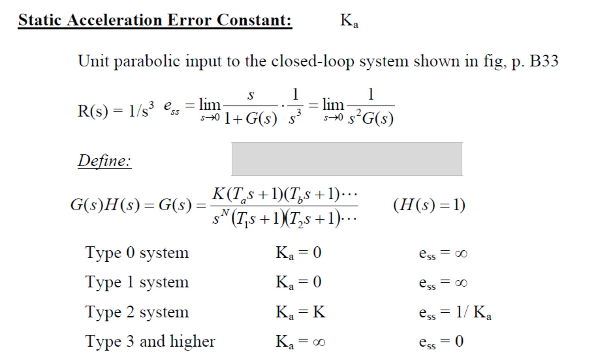
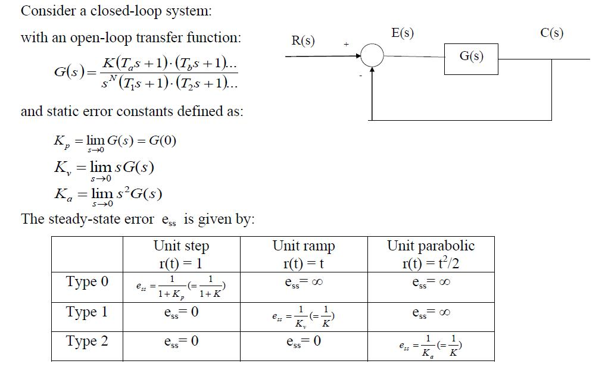
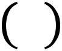
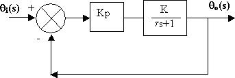
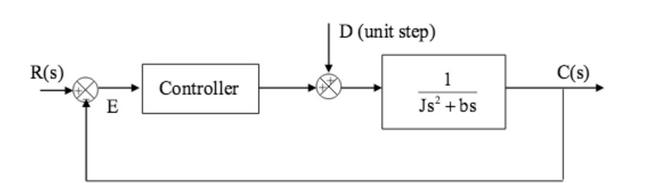

ELEC 360

> Control Theory and Systems I

{width="12.67986111111111in"
height="4.811805555555556in"}

> Closed loop TF

Stability

(Routh

Stability

test)

System dependent

Closed Loop

Control System

Closed loop TF

> Transient Response (Unit step response – settling time, overshoot,
> rise time)
>
> System dependent
>
> Open loop TF

Steady State error

> (unit step – Kp)
>
> (unit ramp – Kv)

(unit parabola – Ka)

> Input dependent
>
> Type of a system

{width="7.951388888888889in"
height="1.0in"}

-   Number of poles at origin in open loop TF

-   Type 0, Type 1, Type 2, etc.

> List & Define: Steady state error constants
>
> Represent: Proportional, Integral & Derivative Controllers
>
> Analyze: Impact of integral & derivative control actions
>
> For a **stable** closed loop control system with **unity feedback**,
> **steady** **state performance** for different input signals (step,
> ramp, acceleration etc.) can be obtained from the **open-loop**
> transfer function

{width="11.643055555555556in"
height="4.025in"}

{width="11.265277777777778in"
height="5.0152777777777775in"}

{width="11.113194444444444in"
height="5.686805555555556in"}

{width="9.768055555555556in"
height="5.845138888888889in"}

{width="9.811805555555555in"
height="6.006944444444445in"}

> Feedforward transfer functions are given for two systems.
>
> Assume unity negative feedback in both cases

  ----- ------------------ --
  1)=   ( + 3.15)          
                           
        ( + 1.5)( + 0.5)   
  ----- ------------------ --

{width="0.4708333333333333in"
height="0.3875in"}

  ----- ------------ --
  2)=                
                     
        ^2^( + 12)   
  ----- ------------ --

{width="0.4708333333333333in"
height="0.3875in"}

Solution: (a) Check for stability

b.  Compute error constant

<!-- -->

(c) Compute steady state error

**P**roportional controller TF = Kp

**D**erivative controller TF = Kd s

**I**ntegral controller TF = Ki /s

**P**roportional + **I**ntegral = Kp + Ki /s = Kp (1 + 1/sTi)

**P**roportional + **D**erivative = Kp + Kd s = Kp (1 + sTd)

**P**roportional + **I**ntegral + **D**erivative = Kp + Ki /s +Kd s = Kp
(1 + 1/sTi + sTd)

> Impact of Integral Controller

-   Removes steady state error

{width="4.9847222222222225in"
height="1.6715277777777777in"}

> Example: Impact of step input

-   Introduces oscillations – tending towards instability

{width="6.813194444444444in"
height="1.9118055555555555in"}

> Example: Impact of step change in disturbance signal

**Proportional + Integral** = removes steady state error, improves
stability

-   Improves stability

-   Increases damping

-   Allows for high value of system gain

-   Cannot be used alone

> **Proportional + Derivative**

**Proportional + Integral + Derivative**
